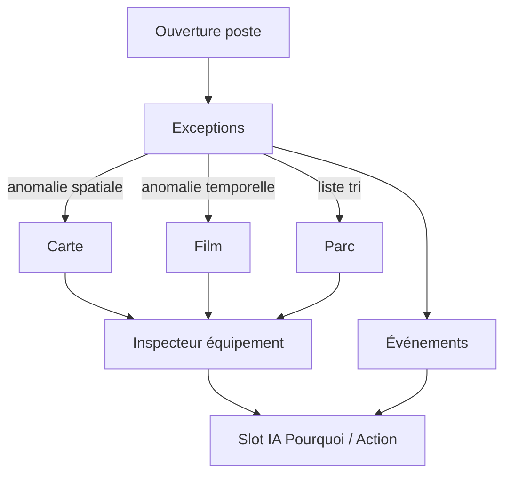

# MinePulse — Architecture d'information (FR)

**Statut :** verrouillée pour le prototype V1  
**Langue UI :** français (vocabulaire OPM conservé là où les opérateurs le connaissent)  
**Source :** OPM OCP (inspiration workflow, pas clone UI)

---

## Positionnement

| Système | Question principale |
|---|---|
| OPM aujourd'hui | Que se passe-t-il ? |
| MinePulse | Que se passe-t-il ? / Pourquoi ? / Que va-t-il se passer ? / Que faire ? |

L'IA agentique (LangGraph) viendra **plus tard**. En V1 : emplacements réservés, copy mockée, jamais une page « Chatbot ».

---

## Navigation principale

```
┌─────────────────────────────────────────────────────────────┐
│ MinePulse │ Site ▾ │ Poste ▾ │ Recherche │ LIVE │ 🔔 │ User │
├────┬────────────────────────────────────────────────────────┤
│ S  │  Modes Supervision (si Supervision actif) :            │
│ P  │  [ Exceptions | Carte | Film | Parc ]                  │
│ É  │                                                        │
│ ⚙  │  Contenu                                               │
└────┴────────────────────────────────────────────────────────┘
```

| Icône nav | Label | Rôle |
|---|---|---|
| S | **Supervision** | Travail quotidien (modes ci-dessous) |
| P | **Performance** | Analyse cycle / KPIs / documents |
| É | **Événements** | Triage alertes & notifications |
| ⚙ | **Paramètres** | Site, seuils, densité (rare) |

**Pas dans la nav :**
- Détail équipement → **inspecteur** (tiroir droit)
- IA → slots contextuels partout

---

## Supervision — modes de vue

| Mode | Ancêtre OPM | Question |
|---|---|---|
| **Exceptions** | Scan mental des cellules rouges | Qu'est-ce qui me demande maintenant ? |
| **Carte** | Plan situation | Où ? (+ éditeur de zones) |
| **Film** | Film camion | Quand / chronologie des états |
| **Parc** | Tableau de bord camions | Liste triable, pas tableur géant |

---

## Vocabulaire OPM à conserver

- Camion, Conducteur, Gasoil, TD, TU, NV  
- Arrêt exploitation / matériel / extérieur / non défini  
- Mouvement à vide, Attente de chargement, Chargement  
- Mouvement à charge, Attente déchargement, Déchargement  
- Cycle actuel, Durée moyenne  
- Film, Poste, Actualiser → remplacé côté chrome par **LIVE**  
- Entreprise / site (ex. Sidi Chennane)

---

## Flux opérateurs



---

## Types de zones (Carte → contexte IA futur)

| Type | Usage |
|---|---|
| Chargement | Banc / pelle |
| Dump / Déchargement | Stériles / stock |
| Concasseur | Primary crusher |
| Station fuel | Ravitaillement |
| Atelier | Maintenance |
| Parking | Attente / fin de poste |
| Zone restreinte | Sécurité |

Chaque zone : **nom, type, couleur, description**.

---

## Prochaines livrables design

1. Wireframes lo-fi (niveaux de gris) — dossiers `wireframes/`  
2. Specs hi-fi OCP (vert / blanc / gris) — `hifi/`  
3. Prototype UI code — **uniquement sur demande séparée**
